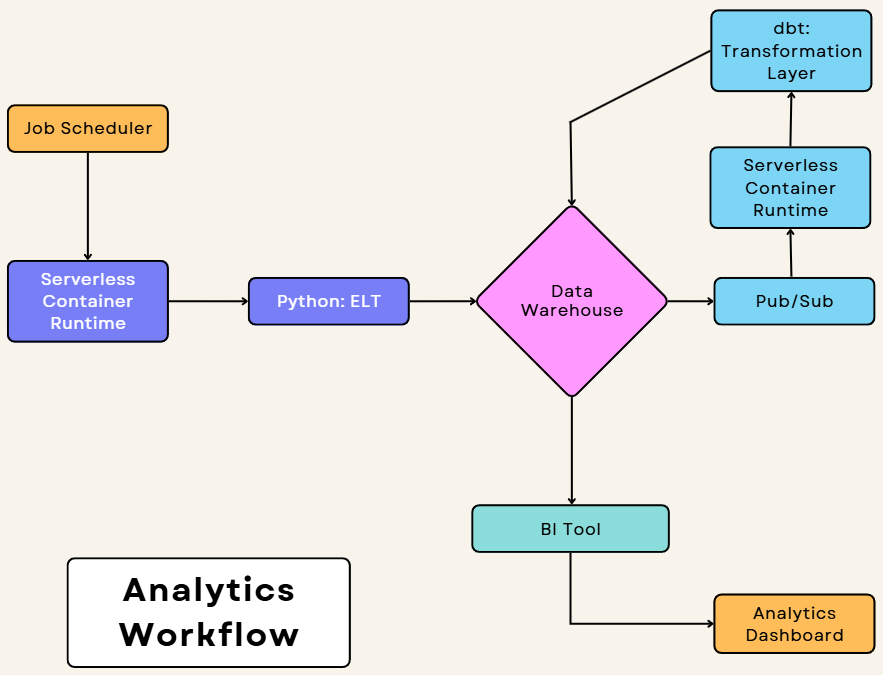
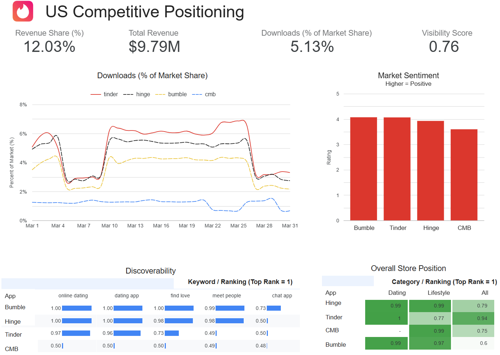
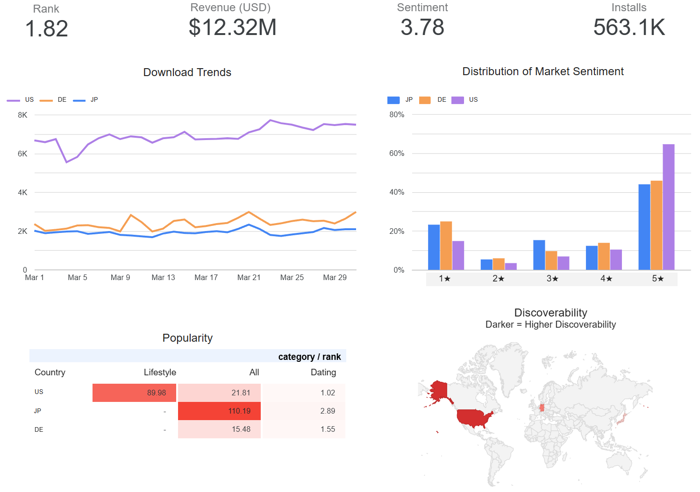

# Tinder AppTweak Analytics

## Analytic Focus

1. Competitive Landscape

The global dating app market has become increasingly saturated, with strong regional competitors and niche platform
eroding Tinder’s market share in key geographies. Competitors differentiate through features such as algorithmic
matching, community focus, or cultural positioning, making it harder for Tinder to maintain user acquisition efficiency
and engagement. Without a clear, data-driven understanding of competitive positioning by market and category, Tinder risks
declining visibility, lower install growth, and reduced user retention.

2. Localization

Tinder’s current product, marketing, and App Store presence are not sufficiently localized to meet the cultural, linguistic,
and behavioral expectations of users across diverse markets. As a result, conversion rates, engagement, and retention vary
significantly by country. Without deeper localization of features, messaging, and keyword strategy, Tinder risks
underperforming in high-growth international markets and losing ground to locally optimized competitors.

In this project I address both of these issues using AppTweak metrics to better understand the competitive landscape and
localization issues and provide insights into business strategies to drive growth.

## Analytics Workflow

1. Data ingestion

Data is extracted from the AppTweak API using scheduled Python scripts. These scripts run on a fixed cadence
(depends on data freshness requirements) via a cloud scheduler. The API responses are cleaned, validated,
and lightly transformed (e.g. formatting, deduplication, and basic quality checks) before being loaded
into the cloud data warehouse.

2. Transformation / Analysis

Once data is loaded, dbt is used to perform structured transformations inside the warehouse. This includes
building staging models for raw API data, intermediate aggregation layers, and final fact tables. Key metrics
include keyword and category rankings, visibility scores, and country/category-level performance trends, which are
standardized and made consistent across time and markets.

3. Output

The final transformed tables are exposed to a BI tool, where stakeholders can access dashboards showing
performance trends, competitive positioning, and localization insights. These dashboards support both
strategic analysis and operational monitoring.

4. Automation

The entire pipeline is automated using scheduled jobs. Python ingestion runs on a recurring schedule,
followed by dbt transformations triggered after data load completion. This ensures that dashboards are
continuously updated without manual intervention.

## Executive Summary of Findings

This analysis evaluates the competitive positioning, localization performance, and growth opportunities
for Tinder within the global dating app market, with a focus on key competitors including Hinge, Bumble,
and Coffee Meets Bagel. The findings highlight a clear pattern: Tinder leads in scale and visibility, but
faces structural challenges in user intent alignment and international market effectiveness.

Tinder is the category leader in revenue, and broad keyword visibility, maintaining a dominant position in
the "dating app" segment. However, this scale advantage does not fully translate into competitive strength
across all dimensions. Competitors outperform Tinder on more intent-driven and relationship-oriented search
queries, indicating a gap between high-volume acquisition and deeper user intent. This suggests that while
Tinder excels at attracting users, it is less strongly positioned as a platform for meaningful or long-term
connections, an area where Hinge and CMB have differentiated more effectively.

From a geographic perspective, performance varies significantly across markets. The United States drives the
majority of Tinder’s scale and demonstrates strong alignment between acquisition and user satisfaction. Germany,
while smaller in volume, shows high efficiency with strong rankings relative to its size, indicating effective
positioning and offering a potential model for scalable growth. In contrast, Japan underperforms across visibility,
rankings, and engagement metrics, pointing to clear localization gaps. These likely stem from a combination of
cultural misalignment, insufficiently localized keyword strategies, and stronger domestic competition.

A cross-market pattern of polarized user ratings, particularly the fact that the second highest frequency rating
is 1★, suggests inconsistencies in user experience. This represents a risk to long-term retention and brand
perception, reinforcing the gap between acquisition success and sustained user value.

To address these challenges, three strategic priorities emerge. First, Tinder should expand its App Store
Optimization (ASO) strategy beyond generic keywords to include more intent-driven and relationship-focused queries,
improving alignment with user expectations. Second, localization efforts, particularly in underperforming markets
like Japan, should be strengthened through native-language keyword strategies, culturally adapted product
experiences, and localized messaging. Third, product improvements should target key friction points identified
in negative user feedback, especially in onboarding and early user experience, to reduce churn and improve satisfaction.

Overall, Tinder’s position is strong but imbalanced: it dominates in scale but lags in intent alignment and
localization. Addressing these gaps presents a clear opportunity to improve acquisition quality, user satisfaction,
and long-term growth.

## Analytic Outputs

### 1. [Competitive Positioning](https://datastudio.google.com/s/kTUdLrQ0nMw)

### 2. [Localization](https://datastudio.google.com/reporting/895eb4ac-2417-4379-b108-6a6e8045d174)

## Reusability & Scaling

This system is scalable and reusable because it separates concerns into modular layers that can be
independently extended, optimized, and reused across use cases. The ingestion layer, built on scheduled
Python scripts, can easily scale by parallelizing API calls, increasing frequency, or adding new data
sources without impacting downstream logic. Because data is loaded into a centralized warehouse, storage
and compute scale elastically with volume, allowing the system to handle growing datasets without architectural
changes. The transformation layer, implemented in dbt, is inherently modular and version-controlled, enabling
reusable models (e.g., staging, intermediate, and fact tables) to be extended for new markets, metrics, or
analyses with minimal duplication. This also ensures consistency, as the same transformation logic can be
applied across different datasets and time periods.

Reusability is further strengthened by the clear separation between ingestion, transformation, and output. New
data sources can plug into the same pipeline, python functions are modularized to facilitate reused, 
existing dbt models can be reused or adapted, and BI dashboards can be built on standardized tables
without redefining logic. Automation via scheduling ensures the pipeline runs consistently regardless of
scale, while its stateless design allows components to be rerun independently for backfills or updates.
Overall, the system supports both horizontal scaling (more data, more markets) and functional reuse (new analyses,
dashboards, or products) without requiring fundamental redesign, making it robust for long-term growth.

## Data Quality & Reliability

Data quality and reliability are ensured through a combination of validation at ingestion, transformation,
and monitoring layers. Python-based ingestion includes schema validation, completeness checks, and idempotent
loading to prevent duplication. Within the warehouse, dbt tests enforce data integrity through constraints such
as uniqueness, null checks, and referential relationships, alongside custom business logic validations. Additionally,
pipeline monitoring and alerting ensure that failures are detected and addressed quickly, while reconciliation checks
and historical comparisons help identify anomalies over time. This layered approach ensures both accuracy and robustness
as the system scales.

## Project Organization
    root
    ├── data # not uploaded
    │   ├── parameters # contains .json files of all generated parameters
    │   ├── processed # contains folder with output dataframes   
    │   └── raw # contains folders with raw output .json files for each query
    ├── images # images used in this readme.md
    ├── models
    │   ├── intermediate # contains the .sql files used to generate intermediate tables
    │   ├── marts # contains the .sql files used to generate fact tables
    │   └── staging # contains the .sql files used to generate staging tables
    ├── notebooks # contains notebooks used to prototype python
    ├── secrets # contains credentials, not uploaded
    ├── src
    │   ├── app_tweak.py # queries apptweak and formats data for upload to cloud
    │   ├── config.py # configures the queries to be run
    │   └── elt_utils.py # utils used to run app_tweak.py
    ├── .env # stores API keys and other private information, not uploaded
    ├── .gitignore
    ├── dbt_project.yml
    ├── package-lock.yml
    ├── packages.yml
    ├── README.md
    └── requirements.txt
